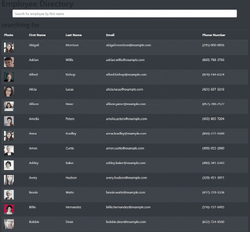

# Employee Directory

## Table of Contents
* [Description](#description)
* [Installation](#installation)
* [Usage](#usage)
* [License](#license)
* [Contributors](#contributors)
* [Test](#test)
* [Questions](#questions)

## Description
You can view a list of all employees with photo, first name, last name, email and phone number. The employees are automatically listed in alphabetical order. You can use the search bar to search the list for a specific employee by their first name. The site is mobile responsive and at a certain breakpoint the table will begin to scroll horizontally.

## Installation 
You can visit the deployed app at https://millerrich.github.io/employee-directory/ or you can clone the project from github and run locally.

## Usage 
Simply type the name of the employee you are looking for into the search bar and the list will automatically update with matching employees as you type.

## License

## Contributors
n/a

## Test
n/a

## Questions
For questions, you can contact the developer at:

Github:[millerrich]

Email:[william.miller.rich@gmail.com]